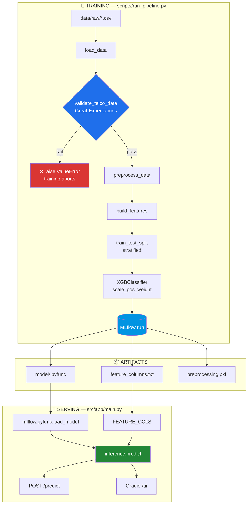
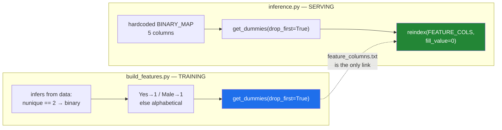
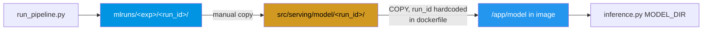
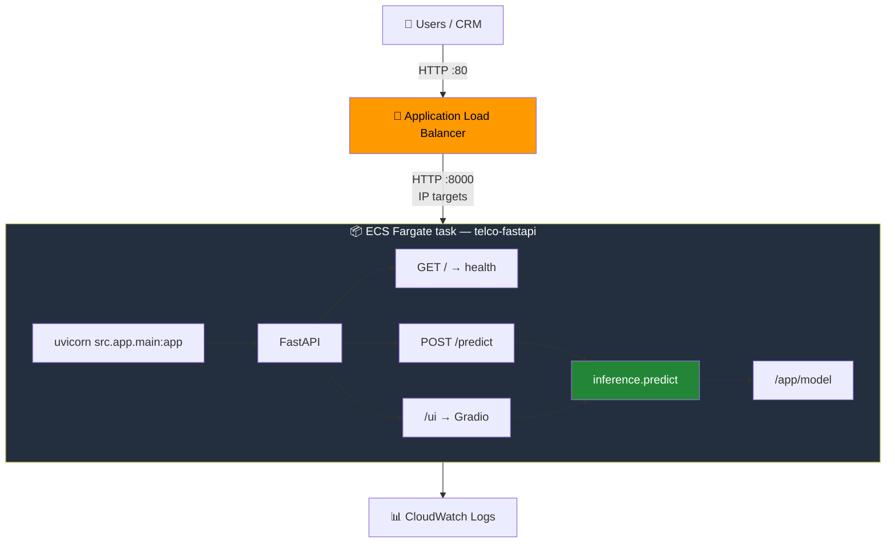
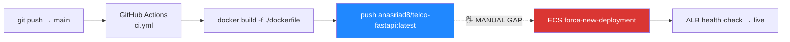

# 🏗️ Project Architecture

Technical reference for the Telco Customer Churn system — how the pieces fit, which
contracts hold them together, and where the sharp edges are.

> 📄 **Related docs:** [`README.md`](README.md) (what it does and why) ·
> [`CLAUDE.md`](CLAUDE.md) (working notes for AI coding agents)

---

## 1. System at a glance

Two pipelines, one shared contract. Training produces a model plus a feature schema;
serving consumes both. Everything else is plumbing.



---

## 2. Module map

| Path | Role | Wired in? |
|---|---|---|
| `scripts/run_pipeline.py` | ⭐ Training orchestrator — the only entry point that produces a servable model | ✅ |
| `scripts/prepare_processed_data.py` | Writes `data/processed/*.csv` without training | ✅ standalone |
| `src/data/load_data.py` | CSV → DataFrame, existence check | ✅ |
| `src/data/preprocess.py` | Drop IDs, coerce `TotalCharges`, map target, fill numeric NaN → 0 | ✅ |
| `src/features/build_features.py` | ⭐ Training-side encoder (binary + one-hot) | ✅ |
| `src/utils/validate_data.py` | Great Expectations suite, hard gate before training | ✅ |
| `src/serving/inference.py` | ⭐ Serving-side encoder + model load + predict | ✅ |
| `src/app/main.py` | ⭐ FastAPI + Gradio, the deployed app | ✅ |
| `src/app/app.py` | Older duplicate of `main.py` | ⚠️ dead |
| `src/models/train.py` | Alternate trainer (different hyperparams, no threshold) | ⚠️ dead |
| `src/models/tune.py` | Optuna search | ⚠️ dead |
| `src/models/evaluate.py` | Report printer | ⚠️ dead |
| `src/utils/utils.py` | File logger factory | ⚠️ unused |

⭐ = load-bearing. ⚠️ = present but not on any live path; safe to delete or revive deliberately.

---

## 3. The central contract: train/serve feature parity

This is the part that breaks quietly. **Two independent implementations must agree.**



**The rules:**

1. `build_features` *derives* its encoding from whatever data it sees. `_serve_transform`
   *hardcodes* it. Change either and you must change the other.
2. `feature_columns.txt` ships **next to the model**, not in the codebase. It is the schema
   of record — 29 columns for the currently deployed run.
3. `reindex(fill_value=0)` means **unknown or missing features become 0 silently.** There is
   no error. A schema mismatch produces a confident, wrong prediction.

### ⚠️ Known live gap

The trained model expects **29 features including `SeniorCitizen`**. The `CustomerData`
API schema collects **18 fields and does not include it**. Every request therefore serves
`SeniorCitizen = 0`. Predictions still return — they are just made with that feature pinned.

<details>
<summary>The 29 columns the deployed model expects</summary>

```
gender, SeniorCitizen, Partner, Dependents, tenure, PhoneService,
PaperlessBilling, MonthlyCharges, TotalCharges,
MultipleLines_No phone service, MultipleLines_Yes,
InternetService_Fiber optic, InternetService_No,
OnlineSecurity_No internet service, OnlineSecurity_Yes,
OnlineBackup_No internet service, OnlineBackup_Yes,
DeviceProtection_No internet service, DeviceProtection_Yes,
TechSupport_No internet service, TechSupport_Yes,
StreamingTV_No internet service, StreamingTV_Yes,
StreamingMovies_No internet service, StreamingMovies_Yes,
Contract_One year, Contract_Two year,
PaymentMethod_Credit card (automatic), PaymentMethod_Electronic check,
PaymentMethod_Mailed check
```

`drop_first=True` removes the reference category from each group — e.g. there is no
`PaymentMethod_Bank transfer (automatic)`; it is the implicit baseline.
</details>

---

## 4. Model lifecycle — training does not equal deploying

A retrain **does not** change what production serves. The link is manual.



**To ship a new model:**

1. Train → note the new `run_id`.
2. Copy `mlruns/<exp>/<run_id>/` into `src/serving/model/<run_id>/`
   (must contain `artifacts/model/`, `artifacts/feature_columns.txt`, `artifacts/preprocessing.pkl`).
3. Update the three `COPY` lines in `dockerfile` to the new run ID.
4. Push to `main` → CI builds and pushes the image.
5. Force a new ECS deployment.

**Currently deployed:** run `3b1a41221fc44548aed629fa42b762e0`
The second bundled run (`2ac205f95a264d49b964ab362fe5f4e6`) lacks `preprocessing.pkl`
and would not build cleanly.

### Model load behaviour

`inference.py` loads the model **at import time** — a module-level side effect:

```
MODEL_DIR = "/app/model"                       # 1st: container path
   ↓ on failure
glob("./mlruns/*/*/artifacts/model") → newest  # 2nd: local dev fallback
   ↓ on failure
raise                                          # import of src.app.* fails
```

Consequence: **outside the container, importing anything from `src.app` fails unless
`./mlruns` exists.** Train once locally first, or point `MODEL_DIR` at
`src/serving/model/<run_id>/artifacts/`. The fallback glob does *not* cover the bundled
`src/serving/model/` directory.

---

## 5. Runtime topology



| Concern | Setting | Why it matters |
|---|---|---|
| Health check | ALB → `GET /` on 8000 | Missing this endpoint = targets never go healthy |
| Port mapping | Listener 80 → target group 8000 | Mismatch was a real outage cause |
| Security groups | ALB inbound 80 from `0.0.0.0/0`; task inbound 8000 **from the ALB SG only** | Task is never directly internet-facing |
| `PYTHONPATH` | `/app/src` | Makes `serving.*` importable; `src.app.main:app` works because `WORKDIR=/app` |
| Logs | container stdout/stderr → CloudWatch | Model-load banners print here on boot |

---

## 6. CI/CD — build is automated, deploy is not



- **Secrets required:** `DOCKERHUB_USERNAME`, `DOCKERHUB_TOKEN`
- **No test stage.** The workflow builds and pushes only.
- **The `:latest` tag is mutable** — there is no immutable version to roll back to.
  Pinning an image tag per commit SHA would fix this.
- **The deploy step is manual.** Pushing a new image changes nothing until someone forces
  a new ECS deployment.

---

## 7. Design decisions worth knowing

| Decision | Rationale |
|---|---|
| **Threshold 0.35, not 0.5** | Classification uses `predict_proba >= threshold`, never `model.predict`. A missed churner costs a customer; a false alarm costs a phone call. Recall 0.82 is bought with precision 0.49 deliberately. |
| **`scale_pos_weight` computed at runtime** | Derived from the train split, not hardcoded — survives a change in class balance. |
| **File-based MLflow, no tracking server** | `file://{project_root}/mlruns`. Zero infrastructure; the cost is that runs are local and not shared. |
| **Validation is a hard gate** | `validate_telco_data` raises and aborts training on failure. Bad data cannot silently produce a model. |
| **`drop_first=True`** | Avoids the dummy-variable trap. Requires serving to use identical settings — it does. |
| **Feature schema travels with the model** | `feature_columns.txt` is an MLflow artifact, so a model can never be paired with the wrong schema. |

---

## 8. Sharp edges

| # | Issue | Location |
|---|---|---|
| 1 | `from posthog import project_root` — stray import; the name is reassigned locally ~30 lines later. `posthog` is pinned in `requirements.txt` only to satisfy it. | `scripts/run_pipeline.py:13` |
| 2 | `requirements.txt` pins `great_expectations==1.5.8`, but the code uses the legacy 0.x `ge.dataset.PandasDataset` API. Verify validation actually runs. | `src/utils/validate_data.py` |
| 3 | `/predict` catches every exception and returns `{"error": ...}` with **HTTP 200** — failures look like successes to callers. | `src/app/main.py` |
| 4 | Hardcoded absolute path from another machine (`/Users/riadanas/...`). | `scripts/test_pipeline_phase1_data_features.py` |
| 5 | `SeniorCitizen` in the model but not in the API schema — always served as 0. | §3 above |
| 6 | Model loads at import time, so a bad model path breaks import, not just requests. | `src/serving/inference.py` |
| 7 | No automated tests. `scripts/test_*.py` are manual scripts, not pytest suites, despite `pytest` being pinned. | `scripts/` |
| 8 | Duplicate app (`app.py` vs `main.py`) can drift apart silently. | `src/app/` |

---

## 9. Repository layout

```
.
├── .github/workflows/ci.yml        # build → Docker Hub
├── dockerfile                      # ⚠️ lowercase; pins the served run_id
├── requirements.txt
├── README.md                       # what & why
├── CLAUDE.md                       # notes for AI coding agents
├── PROJECT_ARCHITECTURE.md         # this file
├── notebooks/EDA.ipynb
├── scripts/
│   ├── run_pipeline.py             # ⭐ training entry point
│   ├── prepare_processed_data.py
│   └── test_*.py                   # manual scripts, not pytest
├── src/
│   ├── data/         load_data.py, preprocess.py
│   ├── features/     build_features.py        ⭐
│   ├── models/       train.py, tune.py, evaluate.py   (dead)
│   ├── utils/        validate_data.py, utils.py
│   ├── serving/
│   │   ├── inference.py                       ⭐
│   │   └── model/<run_id>/                    # committed MLflow runs
│   └── app/          main.py ⭐, app.py (dead)
├── data/          # 🚫 gitignored — no dataset in a fresh clone
├── mlruns/        # 🚫 gitignored — no tracking store in a fresh clone
└── artifacts/     # 🚫 gitignored
```

Only `src/serving/model/**` is force-included past `.gitignore`, which is what makes the
repo self-contained enough to `docker build` without training first.

---

## 10. Extension points

Where to plug in new work without fighting the design:

| Want to... | Touch |
|---|---|
| Change the model | `scripts/run_pipeline.py` §STAGE 5 + copy the run + bump `dockerfile` |
| Change features | **Both** `build_features.py` and `_serve_transform` — never one alone |
| Add an API field | `CustomerData` in `main.py`, and confirm it survives into `FEATURE_COLS` |
| Tighten data quality | `src/utils/validate_data.py` — additions are automatically gating |
| Add batch scoring | New script reusing `inference.predict`; the encoder already handles multi-row frames |
| Add the chat layer | See README §🔮 — batch scores + SHAP + a tool-calling `/chat` endpoint |
| Automate deploys | Add an ECS `force-new-deployment` step to `ci.yml` (closes the gap in §6) |
